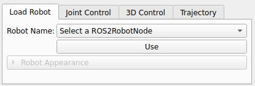

Loading The Robot
==================

To load and visualize the robot in the SlicerROS2 environment, first source the workspace where you have the ROS2 package for the MyCobot 280 M5 if you haven't yet. Ensure all the necessary ROS2 nodes are launched as well.

.. code-block:: bash

   cd ~/ros2_cobot
   source install/setup.bash
   ros2 launch mycobot_ros2_moveit2 demo.launch.py

Then create another terminal, source the workspace again, and navigate to the Slicer executable, and launch Slicer.

.. code-block:: bash

   source ~/ros2_cobot/install/setup.bash
   cd ~/something_something/Slicer-SuperBuild/Slicer-build
   ./Slicer

Once Slicer is launched, you should have the SlicerROS2 module available. Open the module, and follow section 3.3 in the SlicerROS2 documentation to connect to the ROS2 nodes and visualize the robot in Slicer. You should see the MyCobot 280 M5 robot in the 3D view of Slicer.

Loading The Medical Robot Motion Planner
------------------------------------------

To load the Medical Robot Motion Planner, clone the following repository: https://github.com/kaitohl/MedicalRobotMotionPlanner

To add the module to 3D Slicer, navigate to the Edit -> Application Settings - > Modules, and add the path to the MedicalRobotMotionPlanner directory to the list of additional module paths. Then restart Slicer, and you should see the Medical Robot Motion Planner module in the list of modules. You can then open the module and start using it for your motion planning needs!

