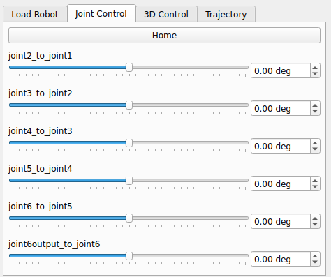
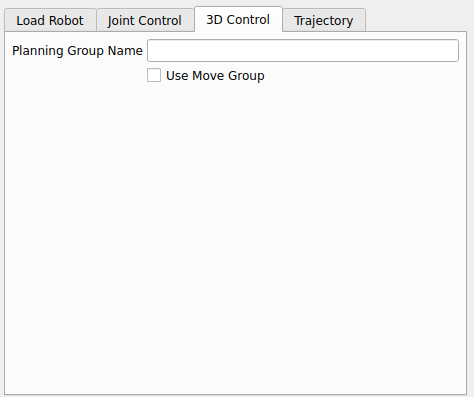
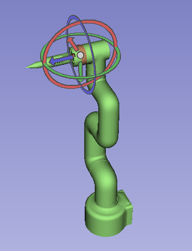
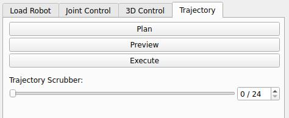
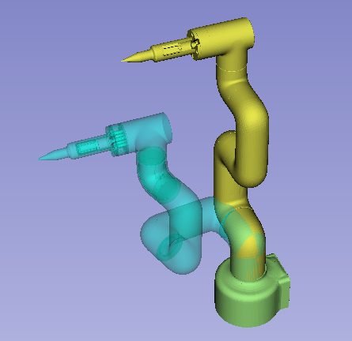

Manipulating The Robot
=======================

After selecting your robot, you get access to the "Joint Control" and "3D Control" tabs. The "Joint Control" tab allows you to control the robot by directly manipulating the joint values, while the "3D Control" tab allows you to control the robot by manipulating the end effector in 3D space.

Joint Control
----------------

Once a robot is selected, the "Joint Control" tab will populate with sliders with names for each joint of the robot. You can use these sliders to manipulate the joint values of the robot, and see the changes in real time in the 3D view. The joint values are shown in degrees, and the sliders are automatically scaled to the joint limits of the robot. You can also input specific joint values in the text boxes next to the sliders. There is an additional "Home" button that will reset all the joint values to their zero position.

3D Control
------------

The "3D Control" tab allows you to manipulate the end effector of the robot in 3D space. You can use the interactive 3D widget to move the end effector to a desired position and orientation, and the robot will automatically calculate the inverse kinematics to move the joints accordingly. This allows for more intuitive control of the robot, as you can directly manipulate the end effector without having to worry about the individual joint values. By default, the inverse kinematics of the robot is calculated using the KDL library. However, if your robot has MoveIt2 support, you can switch to using MoveIt2 for inverse kinematics by selecting the "Use Move group" checkbox. You are required to give the planning group name for your robot, which can be found in the MoveIt2 configuration package for your robot. Once you have entered the planning group name, the robot will use MoveIt2 to calculate the inverse kinematics, which can provide better results for certain robots and configurations.

.. centered:: |control| |robotcontrol|

Trajectory
-----------

The "Trajectory" tab allows you to visualize the trajectory of the robot as you manipulate it in the "Joint Control" and "3D Control" tabs. To use this function, a planning group name is required, and the "Use Move group" checkbox must be selected to use MoveIt2 under the "3D Control" tab. You can set a goal position under either the "Joint Control" or "3D Control" tab by simply moving the robot to a desired position. Once you have set a goal position, and you have given a planning group name, you can navigate to the "Trajectory" tab and plan, preview, and execute a trajectory. The "Plan" button will calculate a trajectory from the current position of the robot to the goal position you set. Once a succesful plan is calculated, a trajectory scrubber will appear allowing you to walk through the trajectory by dragging the slider. You can also preview the entire trajectory by selecting the "Preview" button. Finally, the "Execute" button will execute the planned trajectory, moving the robot to the goal position.

.. centered:: |traj| |trajrobot|

